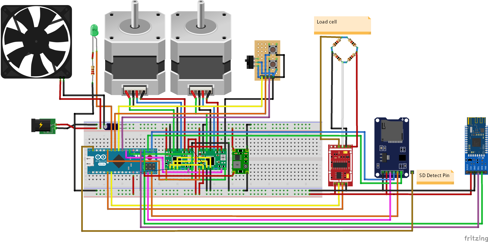
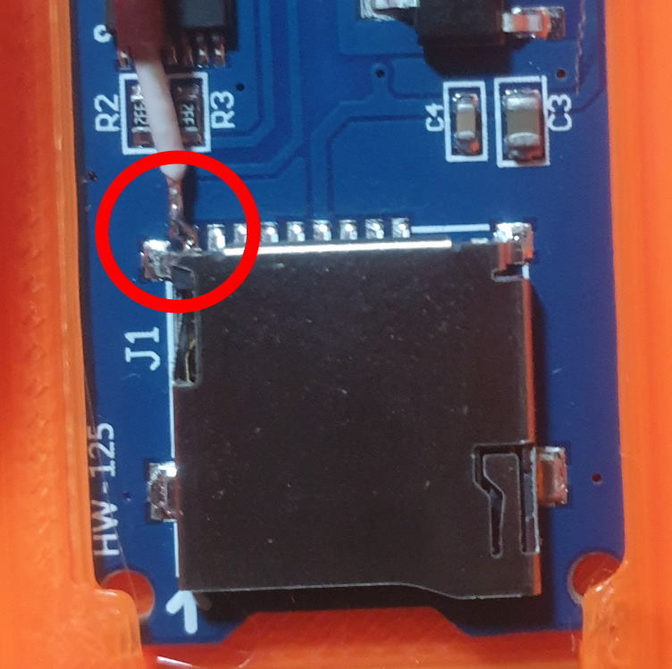
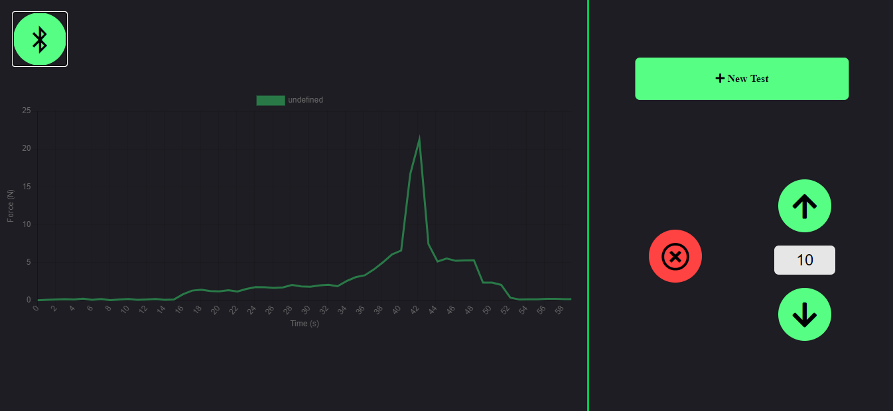

# OpenPull-Web-Controller
---

## Introduction
The OpenPull-Web-Controller is an upgrade for the [DIY Universal test machine](https://github.com/CNCKitchen/Open-Pull) by [CNCKitchen](https://github.com/CNCKitchen).
It ads Bluetooth and Sd functionality to the test Maschine. 
The machine can be controlled over this webinterface: [https://iqwertz.github.io/VWA/](https://iqwertz.github.io/VWA/)

# Upgrade it
---

## Additional Hardware/ and Cad files
---

### CAD
There is an additional cad files for the Sdcard and Ble module holder available.

### Additional Hardware
- DC to Dc Buck Converter 24V-5V
- HM10 Ble Module
- Arduino MicroSD Card Module
- MicroSD Card

### Electronics
Currently the electronics are only as schematics and as images.


Note:

My scematics are for an arduino micro since it was the only one laying around and it has integrated SPI and Serial pins. The code can be modified to use the arduino nano with the software serial library. If there is an interest for it add it as an issue.

Adding an Sd Detect Pin:

My SD card Module didn't had an Sd Detect pin but I found out that it can be added very easy. Just solder a wire to the left pin on the module (red circle in the Picture) and wire it according to the scematics.



## Set Up
---

When everything is wired up, upload the OpenPull.ino to the arduino. Then insert an empty SDcard and plugin the power supply. The Maschine is now ready.

When the Maschine isnt moving the correct amount of distance you need to adjust the stepsPerMM var in the code.
```C++

long stepsPerMM = 39000;

```

## Use 
---

To use the Maschine go to [https://iqwertz.github.io/VWA/](https://iqwertz.github.io/VWA/).

Click on the Bluetooth Symbol in the Top left corner and select the Maschine (The Name is most of the time the producers Name. Mine is DSD Tech as an example.) When the connection is succesfull, you should be able to move it up and down by clicking the arrows.

### Interface


Notes:

With the red Button any Movement can be stopped

The number Field between the up/down arrows is the Move distance in mm when an arrow is clicked.
### Starting a new Test

To Start a new Test press the "New Test" Button

In the "New Test" Window, the Metadata of the Test can be set. It will be saved in the Test file. When the "Start Test" Button on the bottom of the page is pressed the Metadata will be sent the maschine and the test will be started.

Note:
When the progress indicator isnt increasing for some time reset the arduino and the page and retry.

### Data Processing
When an SD Card is inserted, test Data will get saved to it. It is located in an "OPENPULL" folder. 

!!!Important: Do not delete the index.txt file. It keeps track of the last file index. If you want to delete the whole Test Data delete the Folder!!!

To view the Test Data the [online Viewer](https://iqwertz.github.io/VWA/Visualizer/) can be used! 

Repository of the Data Visualizer: [github.com/Iqwertz/OpenPullTestDataVisualizer](https://github.com/Iqwertz/OpenPullTestDataVisualizer)

Example of a test File (JSON):

```JSON
{
  "MetaData": {
    "Name": "Infill 40%",
    "Date": "2020/05/28 19:32:53",
    "Parameter": {
      "Orientation": "Lying ",
      "Material": "PLA ",
      "Infill Type": "Gyroid ",
      "Orientation": "Lying ",
      "Material": "PLA ",
      "Infill Type": "Gyroid ",
      "Orientation": "Lying ",
      "Material": "PLA ",
      "Infill Type": "Gyroid ",
      "Infill": "15 %",
      "Layer Height": "0.3 mm",
      "First Layer Height": "0.3 mm",
      "Nozzle Size": "0.5 mm",
      "Bed Temperatur": "70 °",
      "Nozzle Temperatur": "200 °",
      "Vertical Shells": "3 ",
      "Top Layers": "3 ",
      "Bottom Layers": "3 "
    },
    "TestMode": "M14 A1",
    "Notes": ""
  },
  "Data": [
    0,
    1,
    3,
    6,
    10,
    0
  ],
  "MeasuringIntervall": 0.15,
  "BreakPoint": 419.00,
  "Maximum": 454.65
}
```

